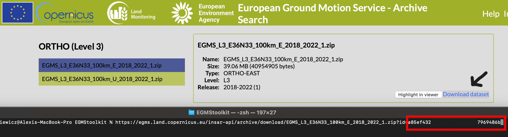

# EGMS toolkit

**EGMS toolkit** is a set of python scripts to download and manage the InSAR data from [European Ground Motion Service](https://egms.land.copernicus.eu). The toolkit allows:
1. to download the data automatically; 
2. merge the files; 
3. clip/crop the results. 

**Release info**: Version 1.0.0 Beta, November, 2023

## 1. Dependencies & Installation 

The requirements are:
- Python3
- GDAL

The required Python packages can be installed by using pip3 or conda: e.g.,

````bash
pip3 install optparse sys warnings numpy math glob pandas subprocess fiona shapely pyproj shutil datetime  wget zipfile urllib3 os osgeo osgeo alive_progress pickle plotly
````

Finally, some system variables must be added. For Linux and MacOS, please add the following lines in your .bashrc file:  

````bash
## For EGMS toolkit
export EGMSTOOLKITPATH= [path of the toolkit]
export PATH=${PATH}:$EGMSTOOLKITPATH:
export PYTHONPATH=${PYTHONPATH}:$EGMSTOOLKITPATH:
export PATHS1BURSTIDMAP=$EGMSTOOLKITPATH/3rdparty
````

> **Tips:** The variable *PATHS1BURSTIDMAP* can be defined by the user. 

## 2 Running the toolbox 

There are two ways to use the toolkit. 

**The user needs to use the temporary token from EGMS website. It can be found at the end of donwloading links (see image below).**




### 2.1 In the terminal 

Please find an example of the script use.

````bash
EGMStoolkit.py -l L2a,L2b -r 2018_2022 -t XXXXXXXXXXXXXXXXXXXX -b -6.427059639290446,53.2606655698541,-6.0952332730202095,53.41811986118854 -o ./Output_directory --track 1 --pass Ascending --nomerging -noclipping --quiet --clean
````

> **Tips:** The -h option is useful to get a help, i.e., EGMStoolkit.py -h 
> **Tips:** The --example option is useful to get an example for Python scripts, i.e., EGMStoolkit.py --example 

````bash
Usage: EGMStoolkit.py [options]

Options:
  -h, --help            show this help message and exit
  -l LEVEL, --level=LEVEL
                        Selected levels of EGMS data: [L2a,L2b,L3UD,L3EW].
                        Default: [L2a,L2b]. The comma can be used for multiple
                        selections.
  -r RELEASE, --release=RELEASE
                        Selected releases of EGMS data: [2015_2021,2018_2022].
                        Default: [2018_2022]. The comma can be used for
                        multiple selections.
  -t TOKEN, --token=TOKEN
                        User token given by EGMS website.
  -b BBOX, --bbox=BBOX  BBOX [WSEN] or country indices or shapefile in
                        EPGS:4326.
  -o OUTPUTDIR, --outputdir=OUTPUTDIR
                        Output directory. Default: ./Output
  --track=TRACK         Track numbers. The comma can be used for multiple
                        selections. Track and Pass must be the same length.
                        Default: None
  --pass=PASSS1         Passes. The comma can be used for multiple selections.
                        Track and Pass must be the same length. Default: None
  --nodownload          Block the downloading of the files. Default: False
  --nounzip             Block the unziping of the files. Default: False
  --nozip               We will remove the .zip files. Default: False
  --nomerging           Block the merging of the EGMS results. Default: False
  --noclipping          Block the clipping/croppring of the EGMS results.
                        Default: False
  --clean               Clean the raw-data files. Default: False
  -q, --quiet           Verbose. Default: True
  --example             Print an example. Default: False
````

### 2.1 In the Python environment  

````python
###########################################################################
# Example of EGMS toolkit in Python environment
###########################################################################
 
###########################################################################
# (0) Import the Python packages
from classes import EGMSS1burstIDapi
from classes import EGMSS1ROIapi 
from classes import EGMSdownloaderapi
 
from functions import egmsdatatools
 
###########################################################################
# (1) Manage the S1 burst ID map 
 
# Create the python variable 
info = EGMSS1burstIDapi.S1burstIDmap()
 
# Print the variable
# info.print()
 
# Active/Deactive the verbose
info.verbose = False # or False
 
# Download the latest ID map
info.downloadfile()
 
###########################################################################
# (2) Check the tile/bursts available according the user imputs
 
# Create the python variable 
ROIpara = EGMSS1ROIapi.S1ROIparameter()
 
# Print the variable
ROIpara.print()
 
# Active/Deactive the verbose
ROIpara.verbose = False # or False
 
# Define the user parameter
ROIpara.egmslevel = 'L2b' # Level of EGMS data
ROIpara.bbox = [-6.427059639290446,53.2606655698541,-6.0952332730202095,53.41811986118854] # Bbox for searching. The European country names can be used (i.e., IE, FR) or a shapefile in EPSG:4326.
ROIpara.release = '2018_2022' # Release of EGMS data
 
# Create the ROI file
ROIpara.createROI()
 
# Detect the burst ID
ROIpara.detectfromIDmap(infoburstID=info,Track=1,Pass='Ascending')
    # Track: track number or list of number
    # Pass: [Ascending or Descending] or list of string
 
# Save the burst ID list
ROIpara.saveIDlistL2() # Or ROIpara.saveIDlistL2(input=saveseach.pkl)
 
# Load the burst ID list
ROIpara.loadIDlistL2() # Or ROIpara.loadIDlistL2(input=saveseach.pkl)
 
# Display a map in the internet browser
ROIpara.displaymap() # Or ROIpara.displaymap(output='fig_search.jog')
 
###########################################################################
# (3) Download the EGMS data
 
# Create the python variable 
downloadpara = EGMSdownloaderapi.egmsdownloader()
 
# Print the variable
# downloadpara.print()
 
# Active/Deactive the verbose
downloadpara.verbose = True # or False

# Create the list of files
downloadpara.updatelist(infoS1ROIparameter=ROIpara)
 
# Print the list of files
downloadpara.printlist()
 
# Possibility to concatenante other research
ROIpara.egmslevel = 'L3'
ROIpara.egmsL3component = 'UD'
ROIpara.release = '2015_2021'
ROIpara.detectfromIDmap(infoburstID=info)
# ROIpara.print()
downloadpara.updatelist(infoS1ROIparameter=ROIpara)
# ROIpara.displaymap()
 
# Print the final list of files
downloadpara.printlist()
 
# Change the user token 
downloadpara.token = 'xxxx'
 
# Download (and unzip) the files
downloadpara.download() # or downloadpara.download(outputdir='./Output',unzip=True,clean=True) 
    # outputdir: output directory [./Output]
    # unzip: unzipping of the downloaded files [True or False]
    # clean: remove the .zip files [True or False]
 
# Unzip the files
downloadpara.unzipfile() # or downloadpara.unzipfile(outputdir='./Output',unzip=True,clean=True) 
    # outputdir: output directory [./Output]
    # unzip: unzipping of the downloaded files [True or False]
    # clean: remove the .zip files [True or False]
# Clean the used files, remove the files that are not in the lists
# downloadpara.clean() # or downloadpara.clean(outputdir='./Output) 
 
###########################################################################
# (4) Post-process of the files (all these steps are optional)
 
# Merge the .csv files 
egmsdatatools.datamergingcsv(infoEGMSdownloader=downloadpara,inputdir='./Output',outputdir='./Output',mode='onlist',verbose=True,paratosave='all') # or egmsdatatools.datamergingcsv()
    # infoEGMSdownloader: output of EGMSdownloaderapi, required with the 'onlist' mode
    # outputdir: output directory [./Output]
    # inputdir: inputdir directory [./Output]
    # mode: merge the files regarding the files available (onfiles) or on the list [onlist or onfiles]
    # verbose [True or False]
    # paratosave: extraction of parameter regarding the EGMS names ['all' or string value]. ['latitude', 'longitude', 'easting', 'northing', 'height', 'height_wgs84'] will always be saved.
 
# Merge the .tiff files (only for the L3 levels)
egmsdatatools.datamergingtiff(infoEGMSdownloader=downloadpara,inputdir='./Output',outputdir='./Output',mode='onlist',verbose=True) # or egmsdatatools.datamergingtiff()
    # infoEGMSdownloader: output of EGMSdownloaderapi, required with the 'onlist' mode
    # outputdir: output directory [./Output]
    # inputdir: inputdir directory [./Output]
    # mode: merge the files regarding the files available (onfiles) or on the list [onlist or onfiles]
    # verbose [True or False]
 
# Clip/crop the data
egmsdatatools.dataclipping(inputdir='./Output',outputdir='./Output',file='all',shapefile='bbox.shp',verbose=True)
    # outputdir: output directory [./Output]
    # inputdir: inputdir directory [./Output]
    # file: list of files for clipping or cropping, they must not to have the '_cropped' or '_clipped' in their names, not in the paths [all] 
    # shapefile: EPGS:4326 shapefile with the ROI [bbox or name files]
    # verbose [True or False] 

# Delete the raw-data directorie
egmsdatatools.removerawdata(inputdir='./Output',verbose=True)
    # inputdir: inputdir directory [./Output]
    # verbose [True or False]))
````

## 3 Developer & Contact

- *Alexis Hrysiewicz,* 
  
  Postdoctoral Researcher, iCRAG / UCD School of Earth Sciences, University College Dublin
  
  Email: alexis.hrysiewicz@ucd.ie 
